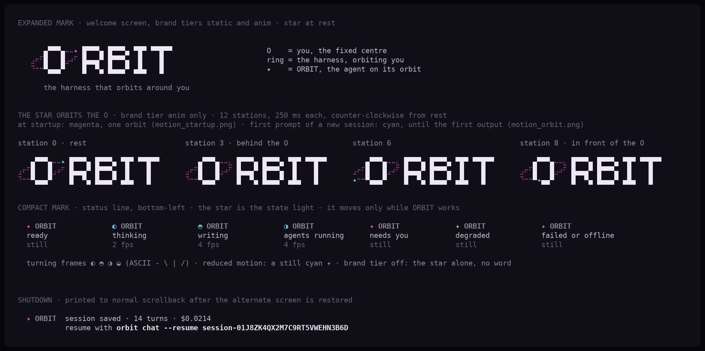
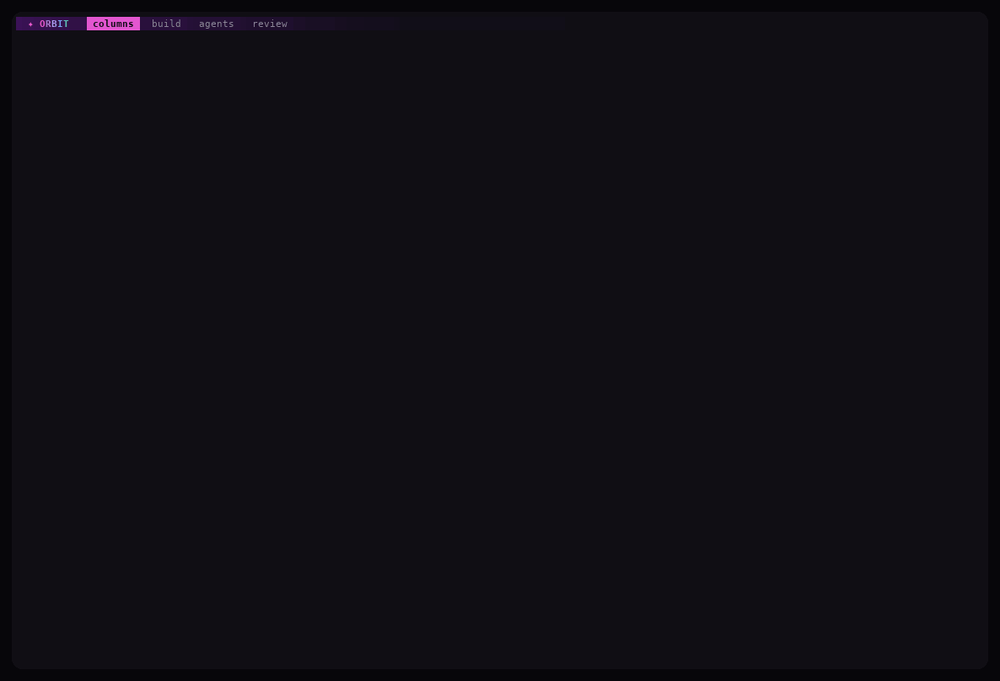
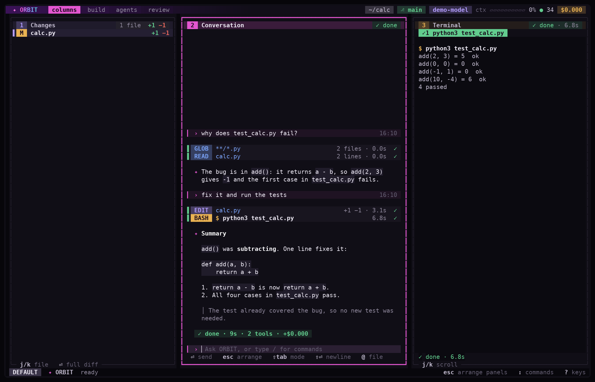
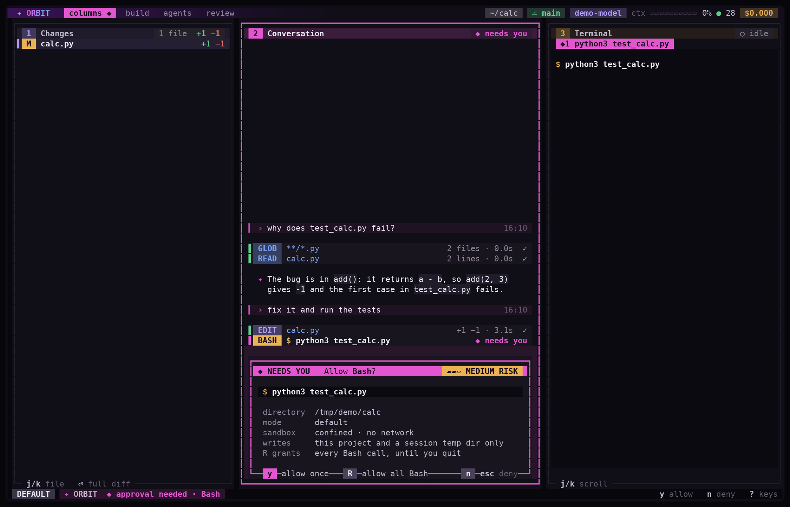
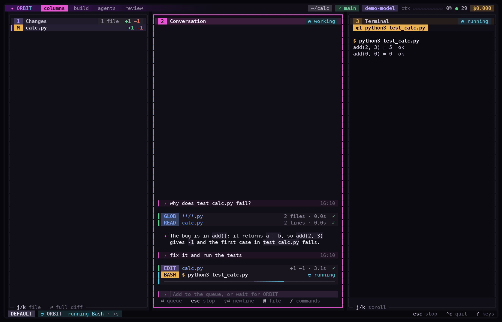
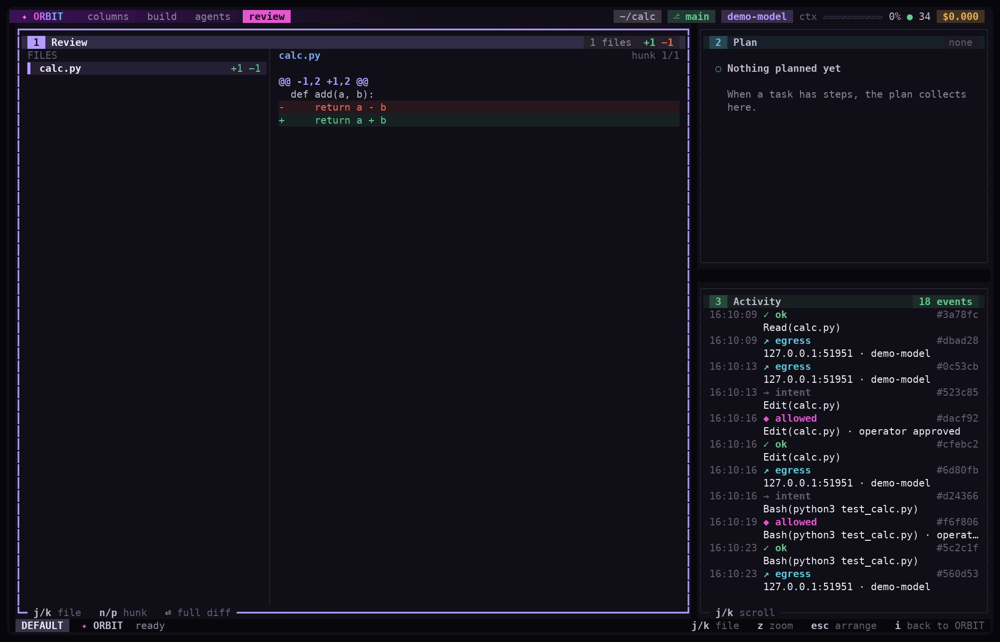

<p align="center">
  
</p>

<h3 align="center">The harness that orbits around you.</h3>

<p align="center">
  <a href="https://www.rust-lang.org"></a>
  <a href="#license"></a>
</p>

---

<p align="center">
  
</p>

<p align="center"><sub>One session in the terminal UI: a question about a failing test, an edit and a
test run that wait for approval, the command's output streaming into the Terminal panel, and the
review layout with the ledger's record of it all. The provider is scripted and the project is a
throwaway fixture.</sub></p>

ORBIT is an open-source AI orchestration harness where **you are the locus of
authority**. Natural-language or typed directives become typed, confirmed,
Ledger-recorded grants; the harness enforces your declared policy, proves what
it did, and protects your information with a strict, non-overridable
compliance kernel.

> **Prove what your agent did. Replay it differently. Route it cheaper.**

## Why ORBIT

Most agent harnesses make you trust them. ORBIT is built so you don't have to:

| | |
|---|---|
| **Prove** | Every turn is a hash-chained Ledger event. `orbit verify-ledger` checks the chain; `orbit replay --dry` re-plans the same work without dispatching a single request. |
| **Protect** | A non-overridable kernel: credentials, keys, hashes and internal identifiers never leave your machine. Prompt bytes never enter the Ledger, exports, logs, or HUD. Untrusted quoted/tool/provider content can never become user authority. |
| **Route** | Declare providers in `providers.toml`; the gateway resolves the right one at dispatch time, with four-gate admission and bounded retry. Credentials are referenced by environment-variable *name*, never stored. |

## The terminal UI

The default front-end is a ratatui interface built from panels. Each panel is
a closed box with its own scroll and selection, and keys go only to the
focused one. Every panel is fed by engine events, so nothing on screen is
placeholder data. Replies type in at 240 characters per second and markdown
arrives as style (headings, emphasis, lists, quotes, links, code), not as
markup.

<p align="center">
  
</p>

<p align="center"><sub>The <code>columns</code> layout after a turn. <b>Changes</b> lists the files ORBIT
edited with their real +/− counts. <b>Conversation</b> holds the prompts, one card per tool call and the
reply. <b>Terminal</b> keeps a tape per command, with its output and outcome.</sub></p>

Reads run freely; edits and commands ask first. The approval card says what
you are approving (an Edit's diff, or the command with its directory, the
permission mode, whether the sandbox confines it and where it may write) and
what `R` would grant:

<p align="center">
  
</p>

<p align="center"><sub>Approving a shell command. <code>y</code> allows it once, <code>n</code> or <code>Esc</code>
denies, and <code>R</code> allows every <code>Bash</code> call until you quit, which the card spells out.
An Edit's card shows its diff in the same place.</sub></p>

<p align="center">
  
</p>

<p align="center"><sub>Mid-turn. The command is still running, its output streams into the Terminal as it is
produced, and the status line names the tool. <code>Esc</code> stops it.</sub></p>

Four layout presets sit in the top bar: `columns`, `build`, `agents` and
`review`. The `review` layout puts the selected file's hunks beside the Plan
and the Activity panel, which lists what the Ledger recorded for each call
(its intent, the decision, the result, the request that left) with the
record's short hash:

<p align="center">
  
</p>

<p align="center"><sub>The <code>review</code> layout. Every row in Activity is a Ledger record; the short hash on
the right is its place in the chain.</sub></p>

`Esc` enters arrange mode: `h j k l` move focus, `H J K L` swap panels, `v`
and `s` split, `p` changes what a panel shows (Conversation, Changes,
Terminal, Plan, Activity, Context, Review or an Agent), `x` closes one,
`< >` and `- +` resize, `z` zooms, `[` and `]` switch presets, and `i` or `⏎`
returns to typing. The layout is saved in `tui.toml` and survives restarts.
The mouse works on what you can see: click a panel to focus it, a layout tab
to switch, a file to select it, an approval chip to answer; the wheel scrolls
the panel under the pointer. `?` lists every key, `/` lists the slash
commands, `:` opens the command palette, and a line that starts with `!` runs
a command of your own.

Colour is negotiated with the terminal rather than assumed: true colour, 256,
16 and no colour (`NO_COLOR` is honoured) each have their own palette, and
colour effects such as fades switch off at the low end while glyph motion
keeps running. On a narrow terminal the UI shows one panel at a time behind
numbered tabs, and below 40×10 it shows a single notice that the window is
too small.

> **Try it without building anything.** [`docs/tui/prototype.html`](docs/tui/prototype.html)
> is the interactive design prototype the terminal UI was built from: a
> self-contained canvas simulation you can open in any browser, with a motion
> gallery where every animation loops side by side. What the binary renders
> today is in [`docs/tui/shots`](docs/tui/shots).

## Status

**Active development.** The v0.1 specification is frozen (12 Aug 2026). The
release-gate claims this README once made ("implementation-complete",
"audited release-ready") were not accurate: the capability gap analysis of
2 Oct 2026 found no working tools, one provider kind and four copies of the
agent loop. Work since then follows the six-phase plan in
[`docs/roadmap/orbit-roadmap.md`](docs/roadmap/orbit-roadmap.md), whose last
section, "Where this stands", lists what is done.

**The tests for gates 1 to 6 pass.** `tests/tests/gates.rs` (gates 1, 2, 3, 4
and 6) and `tests/tests/scenarios.rs` (gate 4's rewind and gate 5) drive the
real binary against a scripted provider. Two limits apply. The roadmap also
requires each gate to run once against a real model through the Anthropic
adapter, and no such run is recorded in this repository, so by that rule no
gate counts as passed yet. And gate 6's test covers the allowlist, the JSON
summary, the exit codes and the recorded decisions; it does not run the
GitHub Action or verify an export on another machine.

The shell tool now drains its pipes while a command runs and stops a process
group with the `kill(2)` system call. Shelling out to `kill -TERM -<pgid>`
could signal every process of the user on procps-ng 4.0.4.

| Track | State |
|---|---|
| v0.1 specification (DR-01..DR-14) | Frozen 12 Aug 2026 |
| v0.1 release candidate | `v0.1.0-rc.1` is tagged; `spec/spec-manifest.yaml` still records `implementation_complete: NO` and `audited_release_ready: NO` |
| Roadmap gates 1–6 | Scripted tests pass; no real-model run yet |
| Terminal UI | The default front-end; the earlier three-pane HUD stays behind `--old-tui` |

## What is ORBIT

ORBIT gives senior technical operators a trustworthy, auditable,
provider-aware orchestration environment. It can prove what an agent did,
replay the same work under controlled differences, and route the orchestrator
deliberately without silently weakening trust or semantics.

The product spine:

- **Trust Spine** — trust root, append-only Ledger, PIB identity, encrypted
  export/restore.
- **Phase Router + HUD** — five-phase reactor FSM, display-safe event
  rendering, brand/output-mode negotiation.
- **Trace / Replay** — hash-chained Ledger events, deterministic replay
  planning, no-dispatch dry runs.
- **Six Primitives** — Prompt-Execution Block (PEB), Task-To-Execute (TTE),
  Memory-Log (ML), Retest-Attestation (RTA), Evidence-Publish-Block (EPB),
  Subagent-Dispatch-Envelope (SDE).

A strict proof/privacy kernel is non-overridable: credentials, keys, hashes,
and internal identifiers never leave the user's machine to external
providers; the Ledger is truthful and append-only; prompt bytes never enter
the Ledger, exports, logs, or HUD; untrusted quoted/tool/provider/subagent
content can never become user authority.

## Features

- **Multi-provider configuration** — declare providers in `providers.toml`
  with a `kind` of `openai-compatible` (the default), `anthropic` or
  `ollama`; the CLI aggregates models and resolves the right provider at
  dispatch time. Credentials are referenced by environment variable name,
  never stored on disk.
- **Four-gate gateway admission** — trust → capability → egress → fsync, with
  retry bounded to two same-route attempts and never-retry on unsafe errors.
- **Interactive REPL** — streaming multi-turn conversation with slash
  commands (`/help`, `/model`, `/models`, `/clear`, `/usage`, `/sessions`,
  `/resume`), session persistence, and resume.
- **Terminal UI** — a ratatui + crossterm front-end of panels (Changes,
  Conversation, Terminal, Plan, Activity, Context, Review, Agent) in four
  layout presets. It is the default when stdin and stdout are a TTY;
  `--old-tui` keeps the earlier three-pane HUD and `--no-tui` drops to the
  plain REPL. The saved layout and the colour and motion settings live in
  `$ORBIT_HOME/tui.toml`.
- **Tool calling with approval** — reads run freely, edits and commands ask.
  The card shows an Edit's diff, a command's directory, the permission mode,
  the sandbox state and exactly what `R` grants. `y` allows once, `n` or
  `Esc` denies, `R` allows that tool for the rest of the session (for Bash
  that is every command until you quit). Every decision is a Ledger record,
  and a session grant never bypasses the known-tool check.
- **Sandboxed shell** — on Linux, Bash runs under bubblewrap with no network
  and writes limited to the project and a session temp directory. Where the
  sandbox is unavailable, Bash is refused (read-only commands excepted)
  unless `ORBIT_ALLOW_UNSANDBOXED_BASH=1` is set, and the welcome screen and
  the approval card both say that there is no sandbox.
- **Headless and CI** — `orbit -p PROMPT` runs one turn with tools under
  `dontAsk` (anything no allow rule covers is denied and reported, never
  asked). `--output-format` is `text`, `json` or `stream-json`; `--bare`
  skips hooks, skills, mods and MCP discovery; `--json-schema` validates the
  final answer. Exit codes: 0 done, 1 failed, 2 stopped by a permission
  denial, 3 hit `--max-turns`, 130 interrupted.
- **Sessions and context** — transcripts are JSONL you can `--continue` or
  `--resume`; a checkpoint is taken before every prompt; the system prompt
  is built once per session; and the engine compacts the context by itself
  when it crosses 90% of a model's `context_window`, less the room kept for
  the reply. The Context panel shows what fills the window.
- **Extensions** — an MCP client, hooks on 13 events, skills (`SKILL.md`),
  subagents through the Task tool, and signed mods installed with
  `orbit mod install`.
- **Usage and cost accounting** — per-turn and cumulative token counts and
  microdollar costs, surfaced in the top bar, in `/usage` and in session
  files.
- **WASI plugin runtime** — wasmtime 47 with an import allowlist, bounded
  instance pool, and WASI-kill lifecycle.
- **Trace, replay, export, restore** — verify the Ledger hash chain, emit a
  no-dispatch replay plan, encrypt an age bundle, restore into a fresh
  namespace.
- **SDKs** — TypeScript (lead) and Python (parity) expose the IR types and
  workflow descriptors for cross-language conformance.
- **Release evidence** — `orbit version` emits the version, the commit it
  was built from, the build profile, and hashes of the evidence bundle when
  one exists (all computed from the files on disk; no fixed claims).

## Quickstart

```sh
# Build (requires Rust 1.94 — see rust-toolchain.toml)
cargo build --release

# Initialize the trust root, PIB, and Ledger
./target/release/orbit init

# Start the interactive harness (TUI when a TTY is detected)
./target/release/orbit

# Or the explicit alias
./target/release/orbit chat

# Send a single prompt through the pipeline
./target/release/orbit ask "reply with exactly: pong" --model <model>

# List configured models
./target/release/orbit models
```

The harness reads provider configuration from `$ORBIT_HOME/providers.toml`
(default `~/.orbit/`). A missing config falls back to the
`ORBIT_GATE_URL` / `ORBIT_MODEL` / `ORBIT_GATE_TOKEN` environment contract.

## CLI reference

```
orbit [chat]           start the interactive harness (TUI or REPL)
orbit ask PROMPT       send one prompt through a configured gateway
orbit -p PROMPT        headless one-shot with tools (text, json or stream-json)
orbit init             initialize trust root + PIB + Ledger
orbit models           list models from all configured providers
orbit run              run the example phase chain
orbit cancel           cancel the session (terminal: cancelled)
orbit verify-ledger    verify the Ledger hash chain
orbit replay --dry     verify + emit a no-dispatch replay plan
orbit export --to      encrypt an age bundle
orbit restore          restore into a fresh namespace
orbit mod install|list|allow-issuer   signed mods
orbit version          build + evidence facts (computed, no fixed claims)
orbit web              start the browser harness
```

Common flags: `--model <M>`, `--gate <URL>`, `--provider <name>`,
`--home <DIR>`, `--continue`, `--resume <ID>`, `--no-tui`, `--old-tui`,
`--auto-tools`, `--permission-mode <default|acceptEdits|plan|dontAsk|bypass>`.
For `-p`: `--output-format <text|json|stream-json>`, `--allowedTools`,
`--disallowedTools`, `--max-turns`, `--max-cost`, `--bare`,
`--json-schema <file>` and `--worktree <name>`.

## Architecture

```
crates/
  engine           the agent loop every front-end shares
  frontend-protocol  the typed events and actions every front-end speaks
  tools            the tool set, permission modes and rules, secret scanner, shell sandbox
  mcp              MCP client
  reactor          five-phase FSM (init|plan|execute|verify|checkpoint)
  sandbox          Landlock/seccomp profiles, deny-by-default
  context          segmented context, token-window ceiling, eviction
  gateway          four-gate admission, retry policy, cost checking
  ledger           append-only hash-chained event log, single-writer
  trust            trust root, issuer allowlist, policy snapshot
  session          session FSM, restricted ACL, cost tracking
  pib              PibId identity, cross-machine allowlist
  memory           layered global<project<path-local resolution
  export           age-encrypted bundle, immutable restore
  plugin           wasmtime 47 WASI runtime, import allowlist, pool
  egress           EgressIntent digest, allowlist, route-pin
  hud              display gate, output mode, brand, event renderer
  hud-tui          ratatui + crossterm terminal UI front-end
  cli              command dispatch, REPL, TUI gate, headless -p
  web              browser harness: axum SSE/WS projection of the core
  desktop          Tauri shell (outside the default build; needs GTK)
  orbit-core       authority kernel, six primitives
  orbit-api        request/response envelopes, route table
  orbit-ledger     primitive-specific Ledger events
  orbit-ir         deterministic CBOR encoder, cross-language IR
  adapter          provider-neutral message types, content blocks, cost rates
  provider-http    async HTTP adapters (OpenAI-compatible, Anthropic, Ollama), TLS pinning
  mock-provider    conformance target
  release          version evidence, SBOM, provenance
sdk/
  typescript       TypeScript SDK (lead)
  python           Python SDK (parity)
  wit              WIT boundary shims
tests/             gate and scenario tests that drive the real binary
conformance/       cross-language IR conformance corpus
migrator/          legacy-workflow → ORBIT migration
spec/              machine-readable error registry + traceability
evidence/          release evidence bundle (v0.1)
```

## Configuration

### `$ORBIT_HOME`

Defaults to `~/.orbit`. Holds the trust root, PIB, Ledger, sessions, and
provider config.

### `providers.toml`

```toml
[[provider]]
name = "local"
kind = "openai-compatible"   # or "anthropic", "ollama"
url = "http://127.0.0.1:8080"
env = "ORBIT_GATE_TOKEN"     # env-var NAME, never the value

[[provider.models]]
id = "model-a"
context_window = 200000      # enables auto-compaction as the window fills
max_output_tokens = 32000    # the default when omitted

[provider.models.pricing]
input_per_million_microdollars = 200000   # $0.20 per million input tokens
output_per_million_microdollars = 600000   # $0.60 per million output tokens
```

The pricing unit is microdollars per million tokens (the old key names
`*_per_million_microcents` still parse — they were mislabeled; the values
always meant microdollars). Sampling (`temperature`, `top_p`) is sent only
when a model sets it.

### `tui.toml`

Lives in `$ORBIT_HOME`. Holds the saved layout (`[layout.tree]`, rewritten
whenever you rearrange the panels) and colour and motion settings such as
`reduced = true`. Missing or malformed values fall back to defaults.

### Environment

| Variable | Purpose |
|---|---|
| `ORBIT_HOME` | Config directory (default `~/.orbit`) |
| `ORBIT_GATE_URL` | Gateway base URL (fallback) |
| `ORBIT_MODEL` | Default model id (fallback) |
| `ORBIT_GATE_TOKEN` | Bearer token (referenced by `providers.toml`) |
| `ORBIT_ALLOW_UNSANDBOXED_BASH` | Set to `1` to let Bash run unsandboxed where no sandbox is available |
| `ORBIT_ASCII_EMOJI` | Set to `0` to disable ASCII emoji fallback |

## Development

```sh
# Toolchain is pinned to Rust 1.94 via rust-toolchain.toml
cargo build
cargo clippy --workspace --all-targets -- -D warnings
cargo fmt --check

# Dependency policy (permissive-only, default deny)
cargo deny check
```

Tests that stop process groups on purpose (the tools crate, the PTY suite)
run inside a throwaway PID namespace, so a signal can never reach the rest
of your session:

```sh
scripts/in-jail.sh cargo test --workspace
scripts/in-jail.sh env ORBIT_PTY_ALLOW_KILL_TESTS=1 \
  python3 scripts/pty_tui_test.py --binary target/debug/orbit \
  --mock target/debug/orbit-mock-provider
```

`unsafe` is limited to seven small call sites in four crates (the sandbox
probes, the Ledger's file lock, a uid lookup and a child-process signal), each
marked with `#[allow(unsafe_code)]`; the rest of the code has none. The
dependency policy (`deny.toml`) allows MIT, Apache-2.0, BSD-2/3, ISC, 0BSD,
Unlicense, and CC0-1.0; anything else fails the check.

## Project layout

```
.
├── crates/            Rust workspace (28 crates, plus the desktop shell)
├── tests/             gate and scenario tests that drive the real binary
├── sdk/               TypeScript + Python SDKs, WIT shims
├── frontends/         the earlier Go terminal UI (frozen)
├── conformance/       cross-language IR conformance corpus
├── migrator/          legacy-workflow → ORBIT migration
├── spec/              error registry + traceability
├── evidence/          release evidence bundle
├── deploy/            mock provider deployment
├── scripts/           build, e2e, fuzz, packaging, PTY and jail scripts
├── fuzz/              coverage-guided fuzzing
├── docs/              roadmap, TUI design, prototype and screenshots
├── .github/           CI and the headless-run workflow
├── Cargo.toml         workspace manifest
├── deny.toml          cargo-deny policy
└── rust-toolchain.toml
```

## License

Core: **Apache-2.0**. WIT/SDK shims: dual-licensed `(MIT OR Apache-2.0)`.
