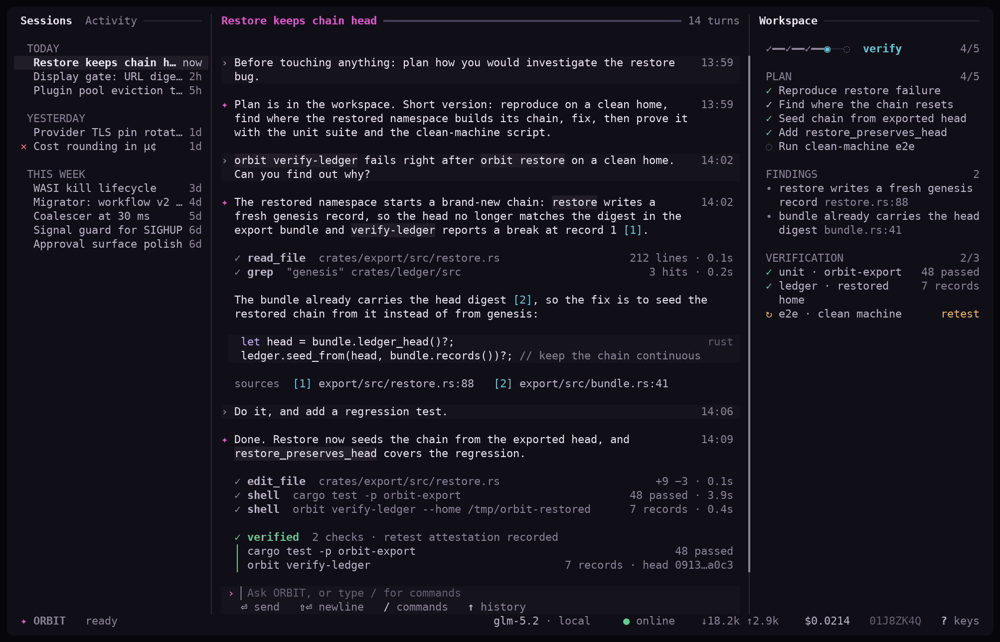
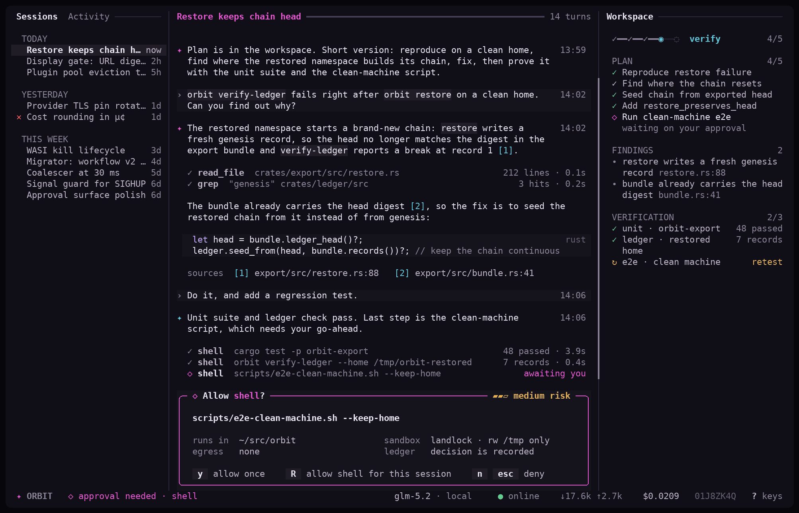
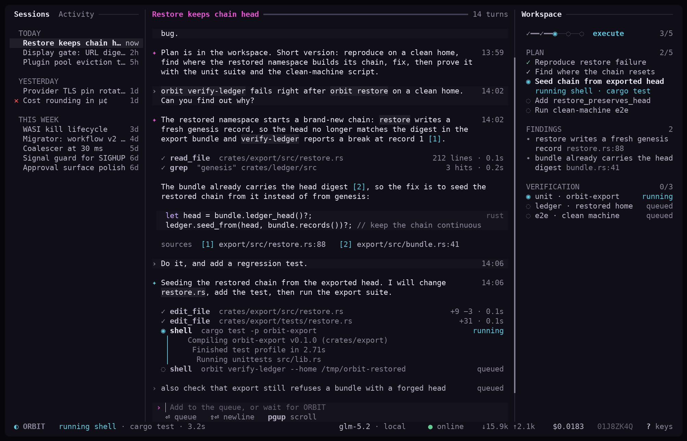
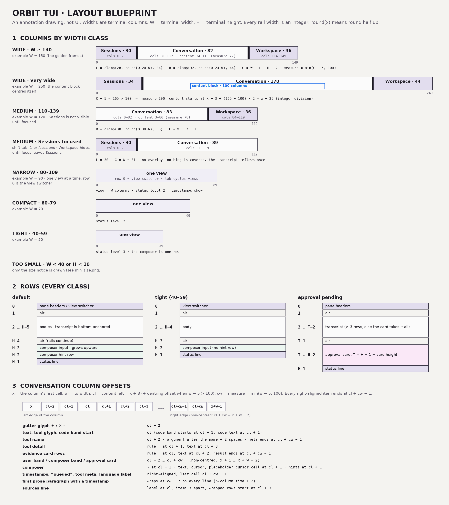
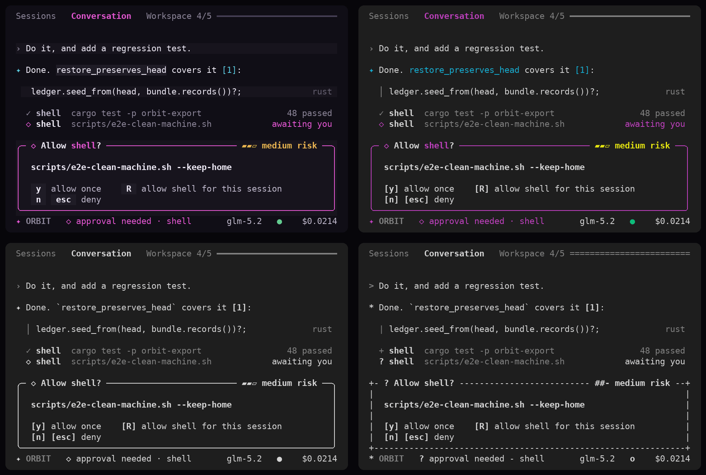
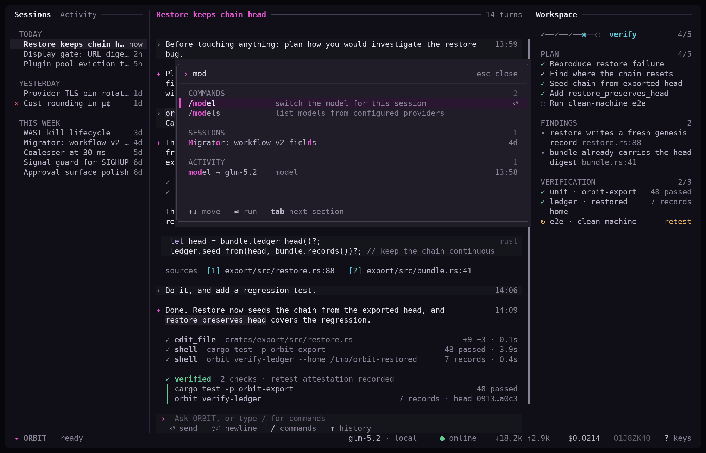
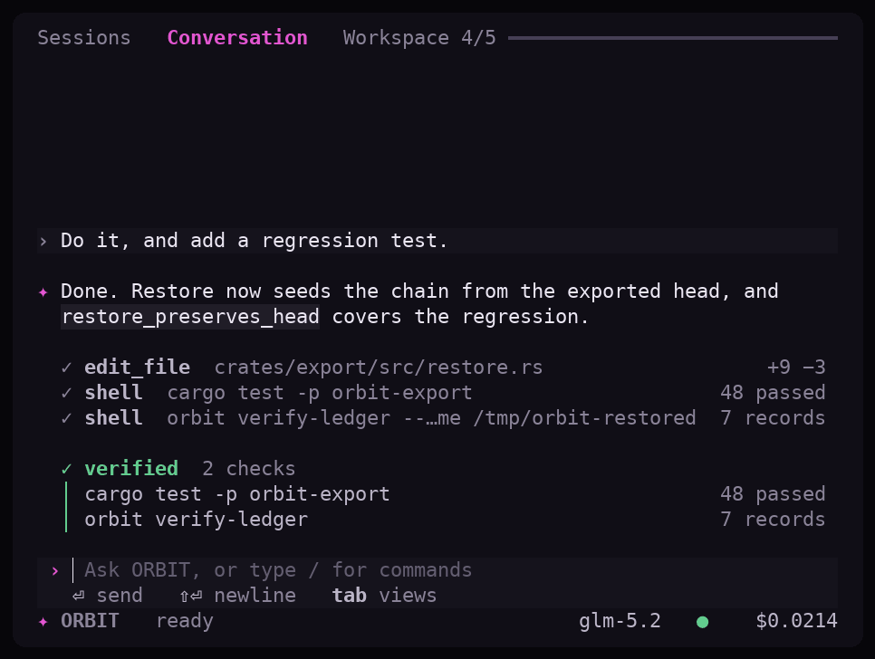
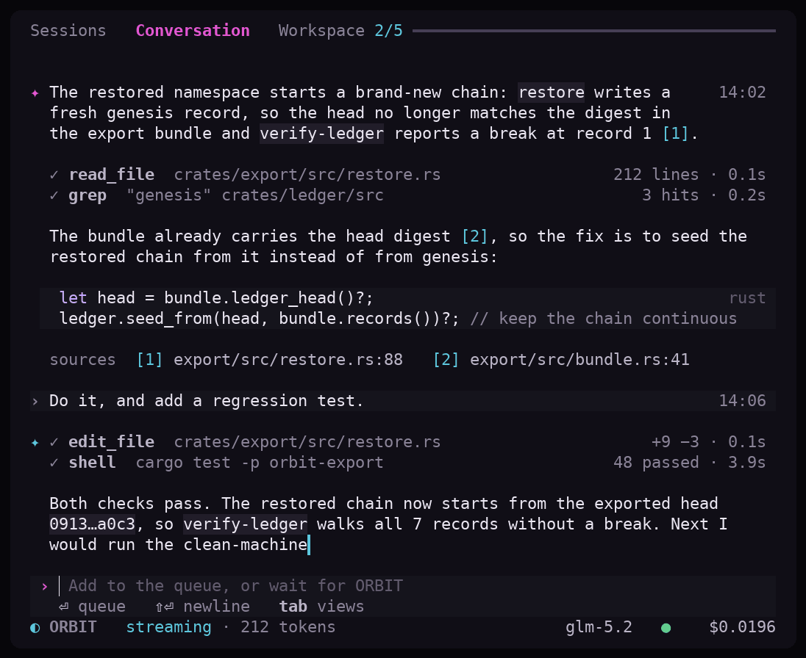

<p align="center">
  
</p>

<h3 align="center">The harness that orbits around you.</h3>

<p align="center">
  <a href="https://www.rust-lang.org"></a>
  <a href="#license"></a>
  
</p>

---

<p align="center">
  
</p>

<p align="center"><sub>A full turn in the ORBIT terminal UI: the user asks, the model streams its reply,
tool calls run as live cards, and everything lands in the Ledger.</sub></p>

ORBIT is an open-source AI orchestration harness where **you are the locus of
authority**. Natural-language or typed directives become typed, confirmed,
Ledger-recorded grants; the harness enforces your declared policy, proves what
it did, and protects your information with a strict, non-overridable
compliance kernel.

> **Prove what your agent did. Replay it differently. Route it cheaper.**

## Why ORBIT

Most agent harnesses make you trust them. ORBIT is built so you don't have to:

| | |
|---|---|
| **Prove** | Every turn is a hash-chained Ledger event. `orbit verify-ledger` checks the chain; `orbit replay --dry` re-plans the same work without dispatching a single request. |
| **Protect** | A non-overridable kernel: credentials, keys, hashes and internal identifiers never leave your machine. Prompt bytes never enter the Ledger, exports, logs, or HUD. Untrusted quoted/tool/provider content can never become user authority. |
| **Route** | Declare providers in `providers.toml`; the gateway resolves the right one at dispatch time, with four-gate admission and bounded retry. Credentials are referenced by environment-variable *name*, never stored. |

## The terminal UI

The default front-end is a motion-first ratatui TUI — a conversation that
*feels* alive: replies type in at 240 characters per second, fresh ink fades
from white to ink, tool calls run as live cards, and the whole thing degrades
gracefully from 24-bit colour down to monochrome without losing information.

<p align="center">
  
</p>

<p align="center"><sub>Wide layout — sessions rail, conversation, workspace rail.</sub></p>

<p align="center">
  
</p>

<p align="center"><sub>Tool approval: <code>y</code> allow once, <code>R</code> always-this-session (Ledger-logged,
revocable), <code>n</code>/<code>Esc</code> deny.</sub></p>

<p align="center">
  
</p>

<p align="center"><sub>Streaming: the newest chunk lands near-white and settles to ink in 450 ms.</sub></p>

The layout is yours to arrange — split, swap, resize, save — and it survives
restarts:

<p align="center">
  
</p>

<p align="center"><sub>Arranging: <code>h j k l</code> move, <code>H J K L</code> swap, <code>v</code>/<code>s</code> split, <code>[ ]</code> cycle presets.</sub></p>

Colour is negotiated with the terminal, not assumed. Sixteen tiers from
true-colour to mono, each a hand-tuned palette — and colour *effects*
(shimmer, fades, flashes) switch off under 16 colours while glyph motion
keeps running:

<p align="center">
  
</p>

<p align="center">
  
</p>

<p align="center"><sub>The command palette (<code>⌘K</code>-style, but it's <code>Ctrl+P</code> because terminals).</sub></p>

And it fits whatever terminal you have:

<p align="center">
  
  
</p>

<p align="center"><sub>Compact and narrow layouts; below 40×10 the UI becomes a single honest notice.</sub></p>

> **Try it without building anything.** The interactive prototype —
> [`docs/tui/prototype.html`](docs/tui/prototype.html) — is a self-contained
> canvas simulation of the TUI (open it in any browser). It has a live
> prototype tab, a motion gallery where every animation loops side by side,
> and the full spec.

## Status

**Active development.** The v0.1 specification is frozen (12 Aug 2026).
The v0.1 release-gate claims previously printed here ("implementation-
complete", "audited release-ready") were not accurate: the capability
gap analysis of 2 Oct 2026 found no working tools, one provider kind,
and four copies of the agent loop. Development then followed the
repair guide (`REPAIR_GUIDE`): the B (blocker), S (security), E
(error-mapping) and C (CLI honesty) finding series have landed with
their scenario tests, plus a terminal watchdog that stops a closed
PTY from orphaning the TUI. **Last gate passed: Phase 4 (turn
integrity)** — compaction, interrupt, hooks and attestation — via the
scenario suite in `tests/tests/scenarios.rs`. The TUI redesign
(prototype motion work) is in progress on top.

| Track | State |
|---|---|
| v0.1 spec (DR-01..DR-14) | Frozen, all gates YES |
| v0.1 release candidate | Tagged `v0.1.0-rc.1` |
| v0.2 async + plugins | Complete, on `v0.2-dev` |
| v0.2 terminal UI | In progress, on `main` |

## What is ORBIT

ORBIT gives senior technical operators a trustworthy, auditable,
provider-aware orchestration environment. It can prove what an agent did,
replay the same work under controlled differences, and route the orchestrator
deliberately without silently weakening trust or semantics.

The product spine:

- **Trust Spine** — trust root, append-only Ledger, PIB identity, encrypted
  export/restore.
- **Phase Router + HUD** — five-phase reactor FSM, display-safe event
  rendering, brand/output-mode negotiation.
- **Trace / Replay** — hash-chained Ledger events, deterministic replay
  planning, no-dispatch dry runs.
- **Six Primitives** — Prompt-Execution Block (PEB), Task-To-Execute (TTE),
  Memory-Log (ML), Retest-Attestation (RTA), Evidence-Publish-Block (EPB),
  Subagent-Dispatch-Envelope (SDE).

A strict proof/privacy kernel is non-overridable: credentials, keys, hashes,
and internal identifiers never leave the user's machine to external
providers; the Ledger is truthful and append-only; prompt bytes never enter
the Ledger, exports, logs, or HUD; untrusted quoted/tool/provider/subagent
content can never become user authority.

## Features

- **Multi-provider configuration** — declare one or more OpenAI-compatible
  providers in `providers.toml`; the CLI aggregates models and resolves the
  right provider at dispatch time. Credentials are referenced by environment
  variable name, never stored on disk.
- **Four-gate gateway admission** — trust → capability → egress → fsync, with
  retry bounded to two same-route attempts and never-retry on unsafe errors.
- **Interactive REPL** — streaming multi-turn conversation with slash
  commands (`/help`, `/model`, `/clear`, `/usage`, `/models`, `/sessions`),
  session persistence, and resume.
- **Terminal UI** — a ratatui + crossterm front-end: the motion-first
  prototype screen (Sessions rail, Conversation, Workspace rail) is the
  default when stdin/stdout are a TTY; `--old-tui` keeps the earlier
  three-pane HUD and `--no-tui` drops to the plain REPL. Theme and
  motion settings live in `tui.toml`.
- **Tool calling with approval** — `y` (allow once), `n` (deny), `R`
  (always-allow-this-tool-this-session, ledger-logged, revocable), `Esc`
  (deny). Session-scoped grants never bypass the known-tool check.
- **Usage and cost accounting** — per-turn and cumulative token counts and
  microdollar costs, surfaced in the status bar and session files.
- **WASI plugin runtime** — wasmtime 47 with an import allowlist, bounded
  instance pool, and WASI-kill lifecycle.
- **Trace, replay, export, restore** — verify the Ledger hash chain, emit a
  no-dispatch replay plan, encrypt an age bundle, restore into a fresh
  namespace.
- **SDKs** — TypeScript (lead) and Python (parity) expose the IR types and
  workflow descriptors for cross-language conformance.
- **Release evidence** — `orbit version` emits the version, the commit it
  was built from, the build profile, and hashes of the evidence bundle when
  one exists (all computed from the files on disk; no fixed claims).

## Quickstart

```sh
# Build (requires Rust 1.94 — see rust-toolchain.toml)
cargo build --release

# Initialize the trust root, PIB, and Ledger
./target/release/orbit init

# Start the interactive harness (TUI when a TTY is detected)
./target/release/orbit

# Or the explicit alias
./target/release/orbit chat

# Send a single prompt through the pipeline
./target/release/orbit ask "reply with exactly: pong" --model <model>

# List configured models
./target/release/orbit models
```

The harness reads provider configuration from `$ORBIT_HOME/providers.toml`
(default `~/.orbit/`). A missing config falls back to the
`ORBIT_GATE_URL` / `ORBIT_MODEL` / `ORBIT_GATE_TOKEN` environment contract.

## CLI reference

```
orbit [chat]           start the interactive harness (TUI or REPL)
orbit ask PROMPT       send one prompt through a configured gateway
orbit init             initialize trust root + PIB + Ledger
orbit models           list models from all configured providers
orbit run              run the example phase chain
orbit cancel           cancel the session (terminal: cancelled)
orbit verify-ledger    verify the Ledger hash chain
orbit replay --dry     verify + emit a no-dispatch replay plan
orbit export --to      encrypt an age bundle
orbit restore          restore into a fresh namespace
orbit version          build + evidence facts (computed, no fixed claims)
orbit web              start the browser harness
orbit -p PROMPT        headless one-shot with tools (stream-json)
```

Common flags: `--model <M>`, `--gate <URL>`, `--provider <name>`,
`--home <DIR>`, `--continue`, `--resume <ID>`, `--no-tui`,
`--old-tui`, `--auto-tools`, `--permission-mode <M>`.

## Architecture

```
crates/
  reactor          five-phase FSM (init|plan|execute|verify|checkpoint)
  capability       capability card schema + trust-root manifest
  sandbox          Landlock/seccomp profiles, deny-by-default
  context          segmented context, token-window ceiling, eviction
  gateway          four-gate admission, retry policy, cost checking
  ledger           append-only hash-chained event log, single-writer
  trust            trust root, issuer allowlist, policy snapshot
  session          session FSM, restricted ACL, cost tracking
  pib              PibId identity, cross-machine allowlist
  memory           layered global<project<path-local resolution
  export           age-encrypted bundle, immutable restore
  plugin           wasmtime 47 WASI runtime, import allowlist, pool
  egress           EgressIntent digest, allowlist, route-pin
  hud              display gate, output mode, brand, event renderer
  hud-tui          ratatui + crossterm terminal UI front-end
  cli              command dispatch, REPL, TUI gate
  orbit-core       authority kernel, six primitives
  orbit-api        request/response envelopes, route table
  orbit-ledger     primitive-specific Ledger events
  orbit-ir         deterministic CBOR encoder, cross-language IR
  adapter          provider stream event types, cost rates
  provider-http    async OpenAI-compatible adapter, TLS pinning
  mock-provider    v0.2 conformance target
  release          version evidence, SBOM, provenance
sdk/
  typescript       TypeScript SDK (lead)
  python           Python SDK (parity)
  wit              WIT boundary shims
conformance/       cross-language IR conformance corpus
migrator/          legacy-workflow → ORBIT migration
spec/              machine-readable error registry + traceability
evidence/          release evidence bundle (v0.1)
```

## Configuration

### `$ORBIT_HOME`

Defaults to `~/.orbit`. Holds the trust root, PIB, Ledger, sessions, and
provider config.

### `providers.toml`

```toml
[[provider]]
name = "local"
url = "http://127.0.0.1:4001"
env = "ORBIT_GATE_TOKEN"   # env-var NAME, never the value

[[provider.models]]
id = "model-a"

[provider.models.pricing]
input_per_million_microdollars = 200000   # $0.20 per million input tokens
output_per_million_microdollars = 600000   # $0.60 per million output tokens
```

The pricing unit is microdollars per million tokens (the old key names
`*_per_million_microcents` still parse — they were mislabeled; the values
always meant microdollars).

### `tui.toml`

Customizable theme and layout: accent colors, composer color, spinner style,
pane proportions, tab behavior. Missing or malformed values fall back to
defaults.

### Environment

| Variable | Purpose |
|---|---|
| `ORBIT_HOME` | Config directory (default `~/.orbit`) |
| `ORBIT_GATE_URL` | Gateway base URL (fallback) |
| `ORBIT_MODEL` | Default model id (fallback) |
| `ORBIT_GATE_TOKEN` | Bearer token (referenced by `providers.toml`) |
| `ORBIT_ASCII_EMOJI` | Set to `0` to disable ASCII emoji fallback |

## Development

```sh
# Toolchain is pinned to Rust 1.94 via rust-toolchain.toml
cargo build
cargo test --workspace
cargo clippy --workspace --tests -- -D warnings
cargo fmt --check

# Dependency policy (permissive-only, default deny)
cargo deny check
```

The workspace forbids `unsafe` in all crates. The dependency policy
(`deny.toml`) allows MIT, Apache-2.0, BSD-2/3, ISC, 0BSD, Unlicense, and
CC0-1.0; anything else fails the check.

## Project layout

```
.
├── crates/            Rust workspace (22 crates)
├── sdk/               TypeScript + Python SDKs, WIT shims
├── conformance/       cross-language IR conformance corpus
├── migrator/          legacy-workflow → ORBIT migration
├── spec/              error registry + traceability
├── evidence/          release evidence bundle
├── deploy/            mock provider deployment
├── scripts/           build, e2e, fuzz, packaging scripts
├── fuzz/              coverage-guided fuzzing
├── docs/              design docs, TUI spec + prototype
├── Cargo.toml         workspace manifest
├── deny.toml          cargo-deny policy
└── rust-toolchain.toml
```

## License

Core: **Apache-2.0**. WIT/SDK shims: dual-licensed `(MIT OR Apache-2.0)`.
